# Developer Onboarding: xTrace C++ Hook Injection System

This document provides a comprehensive guide to understanding how the xTrace C++ hook injection system works, including both the legacy tree-sitter approach and the new Clang LibTooling approach.

## Table of Contents

1. [System Overview](#system-overview)
2. [Architecture Components](#architecture-components)
3. [Data Flow](#data-flow)
4. [Hook Injection Process](#hook-injection-process)
5. [Code Structure](#code-structure)
6. [Getting Started](#getting-started)

## System Overview

The xTrace C++ hook injection system automatically instruments C++ code to add debugging/tracing capabilities. It works by parsing C++ source files, identifying methods and variables, and injecting logging statements that capture execution flow and variable states.

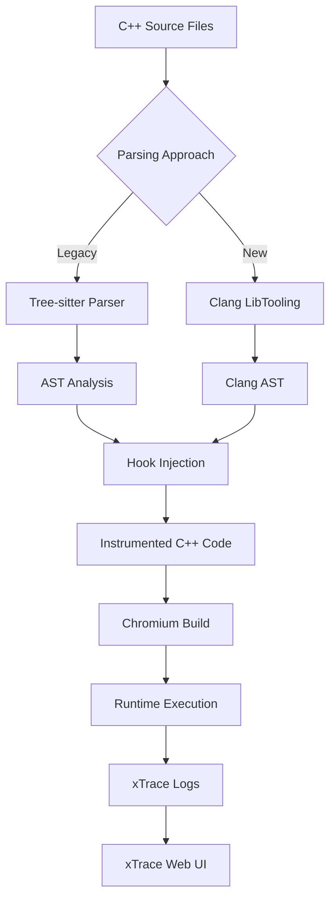
```mermaid
graph TB
    A[C++ Source Files] --> B{Parsing Approach}
    B -->|Legacy| C[Tree-sitter Parser]
    B -->|New| D[Clang LibTooling]
    C --> E[AST Analysis]
    D --> F[Clang AST]
    E --> G[Hook Injection]
    F --> G
    G --> H[Instrumented C++ Code]
    H --> I[Chromium Build]
    I --> J[Runtime Execution]
    J --> K[xTrace Logs]
    K --> L[xTrace Web UI]
```

## Architecture Components

### 1. Core Components State Diagram

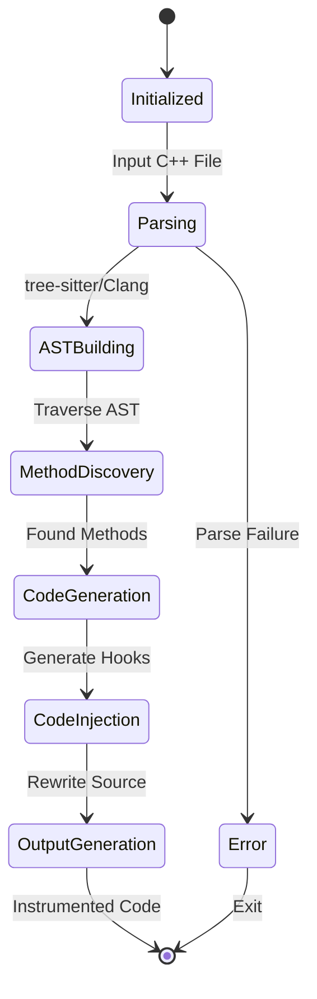
```mermaid
stateDiagram-v2
    [*] --> Initialized
    Initialized --> Parsing: Input C++ File
    Parsing --> ASTBuilding: tree-sitter/Clang
    ASTBuilding --> MethodDiscovery: Traverse AST
    MethodDiscovery --> CodeGeneration: Found Methods
    CodeGeneration --> CodeInjection: Generate Hooks
    CodeInjection --> OutputGeneration: Rewrite Source
    OutputGeneration --> [*]: Instrumented Code
    
    Parsing --> Error: Parse Failure
    Error --> [*]: Exit
```

### 2. Data Structures

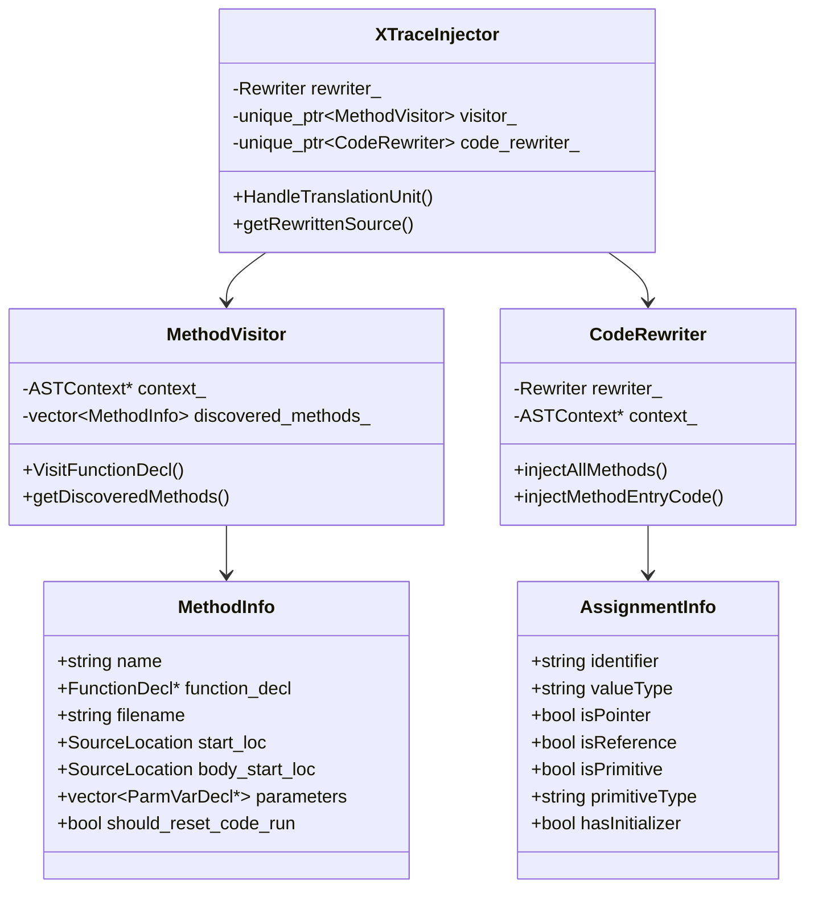
```mermaid
classDiagram
    class MethodInfo {
        +string name
        +FunctionDecl* function_decl
        +string filename
        +SourceLocation start_loc
        +SourceLocation body_start_loc
        +vector~ParmVarDecl*~ parameters
        +bool should_reset_code_run
    }
    
    class AssignmentInfo {
        +string identifier
        +string valueType
        +bool isPointer
        +bool isReference
        +bool isPrimitive
        +string primitiveType
        +bool hasInitializer
    }
    
    class XTraceInjector {
        -Rewriter rewriter_
        -unique_ptr~MethodVisitor~ visitor_
        -unique_ptr~CodeRewriter~ code_rewriter_
        +HandleTranslationUnit()
        +getRewrittenSource()
    }
    
    class MethodVisitor {
        -ASTContext* context_
        -vector~MethodInfo~ discovered_methods_
        +VisitFunctionDecl()
        +getDiscoveredMethods()
    }
    
    class CodeRewriter {
        -Rewriter rewriter_
        -ASTContext* context_
        +injectAllMethods()
        +injectMethodEntryCode()
    }
    
    XTraceInjector --> MethodVisitor
    XTraceInjector --> CodeRewriter
    MethodVisitor --> MethodInfo
    CodeRewriter --> AssignmentInfo
```

## Data Flow

### 1. High-Level Processing Flow

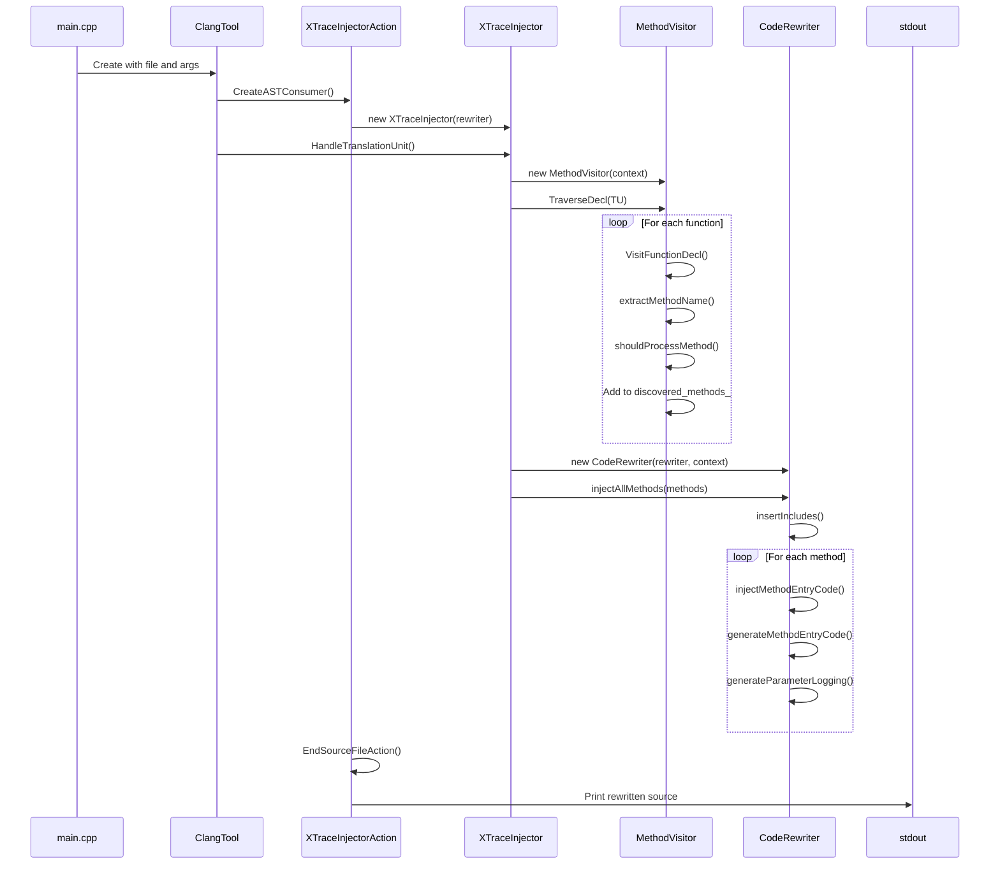
```mermaid
sequenceDiagram
    participant Main as main.cpp
    participant Tool as ClangTool
    participant Action as XTraceInjectorAction
    participant Injector as XTraceInjector
    participant Visitor as MethodVisitor
    participant Rewriter as CodeRewriter
    participant Output as stdout
    
    Main->>Tool: Create with file and args
    Tool->>Action: CreateASTConsumer()
    Action->>Injector: new XTraceInjector(rewriter)
    Tool->>Injector: HandleTranslationUnit()
    
    Injector->>Visitor: new MethodVisitor(context)
    Injector->>Visitor: TraverseDecl(TU)
    
    loop For each function
        Visitor->>Visitor: VisitFunctionDecl()
        Visitor->>Visitor: extractMethodName()
        Visitor->>Visitor: shouldProcessMethod()
        Visitor->>Visitor: Add to discovered_methods_
    end
    
    Injector->>Rewriter: new CodeRewriter(rewriter, context)
    Injector->>Rewriter: injectAllMethods(methods)
    
    Rewriter->>Rewriter: insertIncludes()
    loop For each method
        Rewriter->>Rewriter: injectMethodEntryCode()
        Rewriter->>Rewriter: generateMethodEntryCode()
        Rewriter->>Rewriter: generateParameterLogging()
    end
    
    Action->>Action: EndSourceFileAction()
    Action->>Output: Print rewritten source
```

### 2. Method Discovery Process

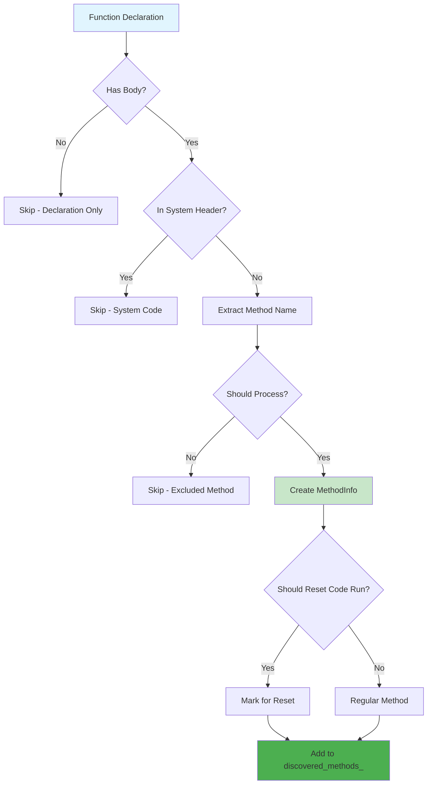
```mermaid
flowchart TD
    A[Function Declaration] --> B{Has Body?}
    B -->|No| C[Skip - Declaration Only]
    B -->|Yes| D{In System Header?}
    D -->|Yes| E[Skip - System Code]
    D -->|No| F[Extract Method Name]
    F --> G{Should Process?}
    G -->|No| H[Skip - Excluded Method]
    G -->|Yes| I[Create MethodInfo]
    I --> J{Should Reset Code Run?}
    J -->|Yes| K[Mark for Reset]
    J -->|No| L[Regular Method]
    K --> M[Add to discovered_methods_]
    L --> M
    
    style A fill:#e1f5fe
    style I fill:#c8e6c9
    style M fill:#4caf50
```

## Hook Injection Process

### 1. Code Injection Strategy

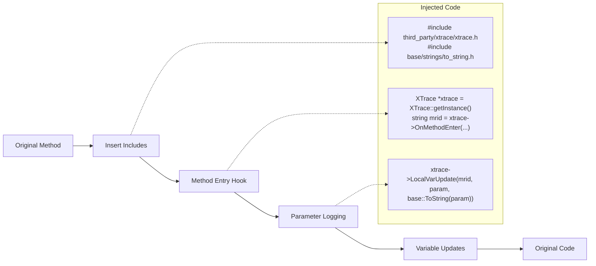
```mermaid
flowchart LR
    A[Original Method] --> B[Insert Includes]
    B --> C[Method Entry Hook]
    C --> D[Parameter Logging]
    D --> E[Variable Updates]
    E --> F[Original Code]
    
    subgraph "Injected Code"
        G["#include third_party/xtrace/xtrace.h<br/>#include base/strings/to_string.h"]
        H["XTrace *xtrace = XTrace::getInstance()<br/>string mrid = xtrace->OnMethodEnter(...)"]
        I["xtrace->LocalVarUpdate(mrid, param, base::ToString(param))"]
    end
    
    B -.-> G
    C -.-> H
    D -.-> I
```

### 2. Code Generation Process

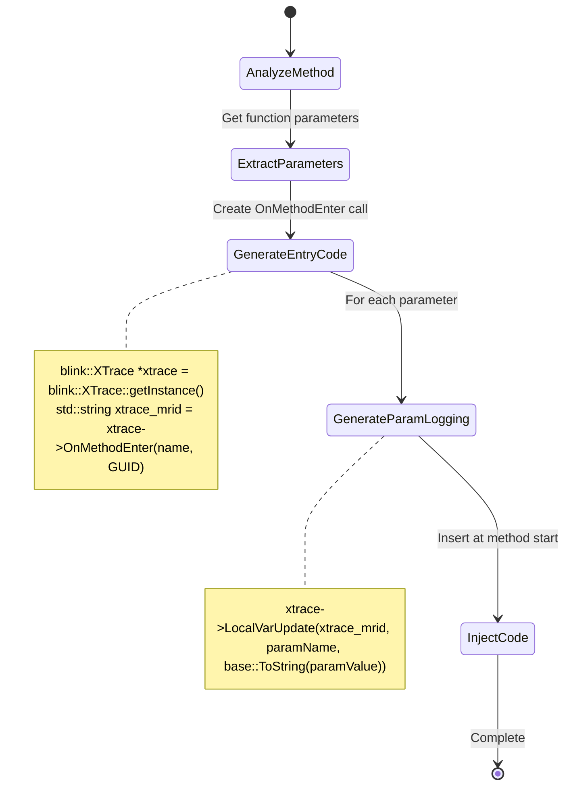
```mermaid
stateDiagram-v2
    [*] --> AnalyzeMethod
    AnalyzeMethod --> ExtractParameters: Get function parameters
    ExtractParameters --> GenerateEntryCode: Create OnMethodEnter call
    GenerateEntryCode --> GenerateParamLogging: For each parameter
    GenerateParamLogging --> InjectCode: Insert at method start
    InjectCode --> [*]: Complete
    
    note right of GenerateEntryCode
        blink::XTrace *xtrace = blink::XTrace::getInstance()
        std::string xtrace_mrid = xtrace->OnMethodEnter(name, GUID)
    end note
    
    note right of GenerateParamLogging
        xtrace->LocalVarUpdate(xtrace_mrid, paramName, base::ToString(paramValue))
    end note
```

### 3. Tree-sitter vs Clang Approach Comparison


```mermaid
graph TB
    subgraph "Tree-sitter Approach (Legacy)"
        A1[C++ Source] --> B1[Tree-sitter Grammar]
        B1 --> C1[Syntax Tree]
        C1 --> D1[Manual AST Walking]
        D1 --> E1[String Manipulation]
        E1 --> F1[Instrumented Code]
    end
    
    subgraph "Clang LibTooling Approach (New)"
        A2[C++ Source] --> B2[Clang Parser]
        B2 --> C2[Clang AST]
        C2 --> D2[RecursiveASTVisitor]
        D2 --> E2[Clang Rewriter]
        E2 --> F2[Instrumented Code]
    end
    
    style A2 fill:#c8e6c9
    style F2 fill:#4caf50
    style A1 fill:#ffecb3
    style F1 fill:#ff9800
```

## Code Structure

### 1. File Organization

```
hooks_injector/
├── clang_injector/                    # New Clang LibTooling approach
│   ├── src/
│   │   ├── main.cpp                   # Entry point
│   │   ├── XTraceInjector.cpp         # Main injector logic
│   │   ├── MethodVisitor.cpp          # AST visitor for methods
│   │   └── CodeRewriter.cpp           # Code rewriting logic
│   ├── include/
│   │   ├── XTraceInjector.h
│   │   ├── MethodVisitor.h
│   │   └── CodeRewriter.h
│   ├── CMakeLists.txt                 # Build configuration
│   └── package.json                   # NPM script wrapper
└── cpp_hooks_injector/                # Legacy tree-sitter approach
    ├── logger.ts                      # Main logging logic
    ├── config.ts                      # Configuration
    └── inject_in_folders.ts           # Folder processing
```

### 2. Key Files and Their Roles

| File | Purpose | Link |
|------|---------|------|
| [`main.cpp`](vscode://file/home/roraja/src/xtrace-core/hooks_injector/clang_injector/src/main.cpp) | Entry point, argument parsing, ClangTool setup |
| [`XTraceInjector.h`](vscode://file/home/roraja/src/xtrace-core/hooks_injector/clang_injector/include/XTraceInjector.h) | Main injector class and FrontendAction |
| [`XTraceInjector.cpp`](vscode://file/home/roraja/src/xtrace-core/hooks_injector/clang_injector/src/XTraceInjector.cpp) | Implementation of injection orchestration |
| [`MethodVisitor.h`](vscode://file/home/roraja/src/xtrace-core/hooks_injector/clang_injector/include/MethodVisitor.h) | AST visitor for discovering methods |
| [`MethodVisitor.cpp`](vscode://file/home/roraja/src/xtrace-core/hooks_injector/clang_injector/src/MethodVisitor.cpp) | Method discovery and filtering logic |
| [`CodeRewriter.h`](vscode://file/home/roraja/src/xtrace-core/hooks_injector/clang_injector/include/CodeRewriter.h) | Code injection and rewriting interface |
| [`CodeRewriter.cpp`](vscode://file/home/roraja/src/xtrace-core/hooks_injector/clang_injector/src/CodeRewriter.cpp) | Code generation and injection implementation |
| [`CMakeLists.txt`](vscode://file/home/roraja/src/xtrace-core/hooks_injector/clang_injector/CMakeLists.txt) | Build configuration for Clang LibTooling |
| [`logger.ts`](vscode://file/home/roraja/src/xtrace-core/hooks_injector/cpp_hooks_injector/logger.ts) | Legacy tree-sitter-based injection logic |
| [`run_e2e.js`](vscode://file/home/roraja/src/xtrace-core/scripts/run_e2e.js) | End-to-end execution pipeline |

### 3. Processing Pipeline

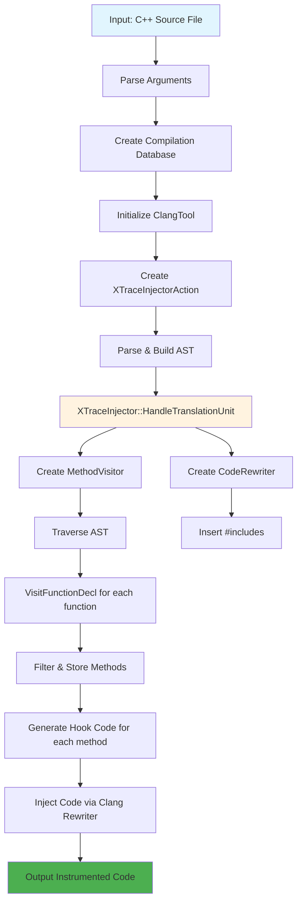
```mermaid
flowchart TD
    A[Input: C++ Source File] --> B[Parse Arguments]
    B --> C[Create Compilation Database]
    C --> D[Initialize ClangTool]
    D --> E[Create XTraceInjectorAction]
    E --> F[Parse & Build AST]
    F --> G[XTraceInjector::HandleTranslationUnit]
    
    G --> H[Create MethodVisitor]
    G --> I[Create CodeRewriter]
    
    H --> J[Traverse AST]
    J --> K[VisitFunctionDecl for each function]
    K --> L[Filter & Store Methods]
    
    I --> M[Insert #includes]
    L --> N[Generate Hook Code for each method]
    N --> O[Inject Code via Clang Rewriter]
    
    O --> P[Output Instrumented Code]
    
    style A fill:#e1f5fe
    style P fill:#4caf50
    style G fill:#fff3e0
```

## Getting Started

### 1. Build and Test

```bash
# Navigate to clang injector directory
cd hooks_injector/clang_injector

# Install dependencies and build
npm run build

# Test with sample file
npm run test

# Use on specific file
./build/xtrace-clang-injector /path/to/file.cpp -- -std=c++17
```

### 2. Integration with xTrace Pipeline

The C++ hook injection is integrated into the larger xTrace pipeline via [`run_e2e.js`](vscode://file/home/roraja/src/xtrace-core/scripts/run_e2e.js):

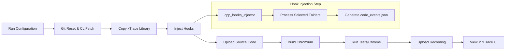
```mermaid
flowchart LR
    A[Run Configuration] --> B[Git Reset & CL Fetch]
    B --> C[Copy xTrace Library]
    C --> D[Inject Hooks]
    D --> E[Upload Source Code]
    E --> F[Build Chromium]
    F --> G[Run Tests/Chrome]
    G --> H[Upload Recording]
    H --> I[View in xTrace UI]
    
    subgraph "Hook Injection Step"
        D1[cpp_hooks_injector] --> D2[Process Selected Folders]
        D2 --> D3[Generate code_events.json]
    end
    
    D --> D1
```

### 3. Configuration

Key configuration points:

- **Methods to include/exclude**: Defined in [`MethodVisitor.cpp`](vscode://file/home/roraja/src/xtrace-core/hooks_injector/clang_injector/src/MethodVisitor.cpp) static sets
- **Build flags**: Configured in [`CMakeLists.txt`](vscode://file/home/roraja/src/xtrace-core/hooks_injector/clang_injector/CMakeLists.txt)
- **Runtime config**: Via [`run_e2e.js`](vscode://file/home/roraja/src/xtrace-core/scripts/run_e2e.js) JSON configuration files

### 4. Debugging Tips

1. **Build Issues**: Check LLVM/Clang version compatibility in CMakeLists.txt
2. **Parse Errors**: Use `--verbose` flag and check Clang compilation database
3. **Missing Hooks**: Verify method filtering logic in MethodVisitor
4. **Runtime Issues**: Check generated code syntax and xTrace library linkage

### 5. Next Steps

1. Review the [architecture documentation](vscode://file/home/roraja/src/xtrace-core/docs/002%20-%20Architecture.md)
2. Examine [sample configurations](vscode://file/home/roraja/src/xtrace-core/run_configs)
3. Test with simple C++ files before Chromium integration
4. Understand the [end-to-end pipeline](vscode://file/home/roraja/src/xtrace-core/scripts/run_e2e.js)

---

## Troubleshooting

### Common Issues

| Issue | Symptom | Solution |
|-------|---------|----------|
| LLVM Command Line Conflict | `Option 'X' registered more than once!` | Use LLVM shared library in CMakeLists.txt |
| Parse Failures | Empty output or crash | Check C++ standard flags (`-std=c++17`) |
| Missing Methods | No hooks injected | Review filtering logic in MethodVisitor |
| Build Errors | Linker errors | Verify Clang/LLVM development packages installed |

### Debug Commands

```bash
# Check LLVM installation
llvm-config --version
llvm-config --cxxflags

# Verify library linking
ldd build/xtrace-clang-injector

# Test with minimal file
echo 'int main() { return 0; }' | ./build/xtrace-clang-injector /dev/stdin --
```

This document should get you started with understanding and contributing to the xTrace C++ hook injection system. For specific implementation details, refer to the linked source files.

## Clang AST Library Deep Dive

This section provides detailed explanations of how the Clang AST (Abstract Syntax Tree) library is used in the xTrace injector, specifically for developers unfamiliar with Clang's AST infrastructure.

### 1. What is Clang AST?

The Clang AST is a tree-based representation of C++ source code that preserves both syntactic and semantic information. Unlike simple parsing tools, Clang's AST:

- **Includes full type information**: Knows that `int x` is an integer variable, not just a sequence of tokens
- **Preserves source locations**: Can map back to exact file positions for code modification
- **Handles complex C++ features**: Templates, inheritance, overloading, macros, etc.
- **Provides semantic analysis**: Name resolution, type checking, scope analysis

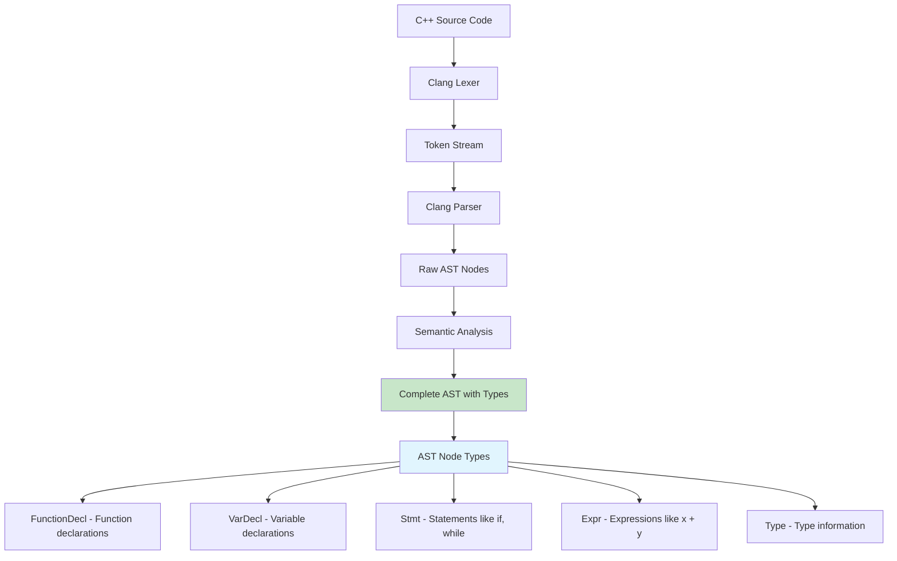
```mermaid
graph TB
    A[C++ Source Code] --> B[Clang Lexer]
    B --> C[Token Stream]
    C --> D[Clang Parser]
    D --> E[Raw AST Nodes]
    E --> F[Semantic Analysis]
    F --> G[Complete AST with Types]
    
    G --> H[AST Node Types]
    H --> I[FunctionDecl - Function declarations]
    H --> J[VarDecl - Variable declarations]  
    H --> K[Stmt - Statements like if, while]
    H --> L[Expr - Expressions like x + y]
    H --> M[Type - Type information]
    
    style G fill:#c8e6c9
    style H fill:#e1f5fe
```

### 2. xTrace's Clang AST Usage Pattern

The xTrace injector follows Clang LibTooling's standard pattern: **ClangTool → FrontendAction → ASTConsumer → RecursiveASTVisitor**

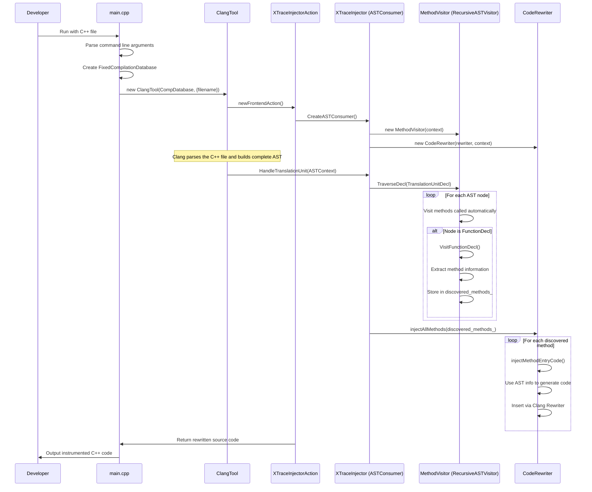
```mermaid
sequenceDiagram
    participant User as Developer
    participant Main as main.cpp
    participant Tool as ClangTool
    participant Action as XTraceInjectorAction
    participant Consumer as XTraceInjector (ASTConsumer)
    participant Visitor as MethodVisitor (RecursiveASTVisitor)
    participant Rewriter as CodeRewriter
    
    User->>Main: Run with C++ file
    Main->>Main: Parse command line arguments
    Main->>Main: Create FixedCompilationDatabase
    Main->>Tool: new ClangTool(CompDatabase, {filename})
    
    Tool->>Action: newFrontendAction()
    Action->>Consumer: CreateASTConsumer()
    Consumer->>Visitor: new MethodVisitor(context)
    Consumer->>Rewriter: new CodeRewriter(rewriter, context)
    
    Note over Tool: Clang parses the C++ file and builds complete AST
    
    Tool->>Consumer: HandleTranslationUnit(ASTContext)
    Consumer->>Visitor: TraverseDecl(TranslationUnitDecl)
    
    loop For each AST node
        Visitor->>Visitor: Visit methods called automatically
        alt Node is FunctionDecl
            Visitor->>Visitor: VisitFunctionDecl()
            Visitor->>Visitor: Extract method information
            Visitor->>Visitor: Store in discovered_methods_
        end
    end
    
    Consumer->>Rewriter: injectAllMethods(discovered_methods_)
    
    loop For each discovered method
        Rewriter->>Rewriter: injectMethodEntryCode()
        Rewriter->>Rewriter: Use AST info to generate code
        Rewriter->>Rewriter: Insert via Clang Rewriter
    end
    
    Action->>Main: Return rewritten source code
    Main->>User: Output instrumented C++ code
```

### 3. Key Clang AST Classes Used by xTrace

#### 3.1 FunctionDecl - Function Declaration Nodes

Every C++ function (including methods, constructors, operators) is represented as a `FunctionDecl` node:

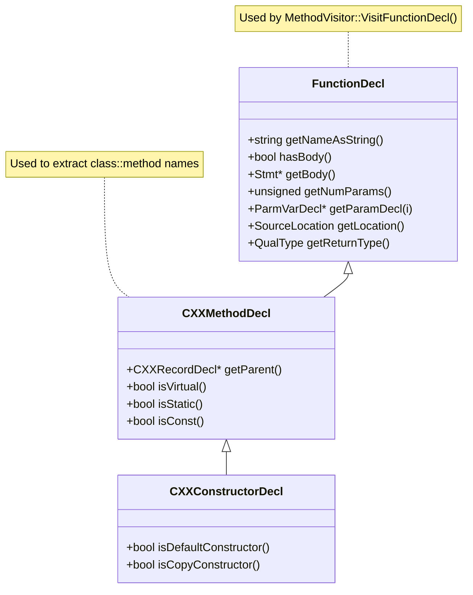
```mermaid
classDiagram
    class FunctionDecl {
        +string getNameAsString()
        +bool hasBody()
        +Stmt* getBody()
        +unsigned getNumParams()
        +ParmVarDecl* getParamDecl(i)
        +SourceLocation getLocation()
        +QualType getReturnType()
    }
    
    class CXXMethodDecl {
        +CXXRecordDecl* getParent()
        +bool isVirtual()
        +bool isStatic()
        +bool isConst()
    }
    
    class CXXConstructorDecl {
        +bool isDefaultConstructor()
        +bool isCopyConstructor()
    }
    
    FunctionDecl <|-- CXXMethodDecl
    CXXMethodDecl <|-- CXXConstructorDecl
    
    note for FunctionDecl "Used by MethodVisitor::VisitFunctionDecl()"
    note for CXXMethodDecl "Used to extract class::method names"
```

**How xTrace Uses FunctionDecl:**

```cpp
bool MethodVisitor::VisitFunctionDecl(clang::FunctionDecl *func_decl) {
    // 1. Check if it's a definition (not just declaration)
    if (!func_decl->hasBody()) {
        return true;  // Skip declarations without implementation  
    }
    
    // 2. Get the function name
    std::string method_name = func_decl->getNameAsString();
    
    // 3. Handle C++ class methods specially
    if (clang::CXXMethodDecl* method = clang::dyn_cast<clang::CXXMethodDecl>(func_decl)) {
        std::string class_name = method->getParent()->getNameAsString();
        method_name = class_name + "::" + method_name;
    }
    
    // 4. Extract parameters for logging
    for (unsigned i = 0; i < func_decl->getNumParams(); ++i) {
        clang::ParmVarDecl* param = func_decl->getParamDecl(i);
        // Store parameter info for later code generation
    }
    
    // 5. Get source location for code injection
    clang::SourceLocation start_loc = func_decl->getLocation();
    clang::SourceLocation body_start = func_decl->getBody()->getBeginLoc();
    
    return true;
}
```

#### 3.2 ASTContext - The AST Management Hub

`ASTContext` is Clang's central registry that manages all AST nodes and provides access to type information:

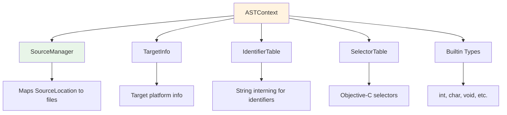
```mermaid
graph TB
    A[ASTContext] --> B[SourceManager]
    A --> C[TargetInfo] 
    A --> D[IdentifierTable]
    A --> E[SelectorTable]
    A --> F[Builtin Types]
    
    B --> G[Maps SourceLocation to files]
    C --> H[Target platform info]
    D --> I[String interning for identifiers]
    E --> J[Objective-C selectors]
    F --> K[int, char, void, etc.]
    
    style A fill:#fff3e0
    style B fill:#e8f5e8
```

**How xTrace Uses ASTContext:**

```cpp
class MethodVisitor : public clang::RecursiveASTVisitor<MethodVisitor> {
private:
    clang::ASTContext *context_;           // Access to type system
    clang::SourceManager *source_manager_; // File location services
    
public:
    MethodVisitor(clang::ASTContext *context) 
        : context_(context), 
          source_manager_(&context->getSourceManager()) {}
    
    std::string getFilename(clang::SourceLocation loc) {
        // Use SourceManager from ASTContext to get file information
        clang::FileID file_id = source_manager_->getFileID(loc);
        const clang::FileEntry* file_entry = source_manager_->getFileEntryForID(file_id);
        return file_entry ? file_entry->getName().str() : "unknown";
    }
};
```

#### 3.3 RecursiveASTVisitor - Automated Tree Traversal

`RecursiveASTVisitor` automatically walks the entire AST tree and calls specific `Visit*` methods:

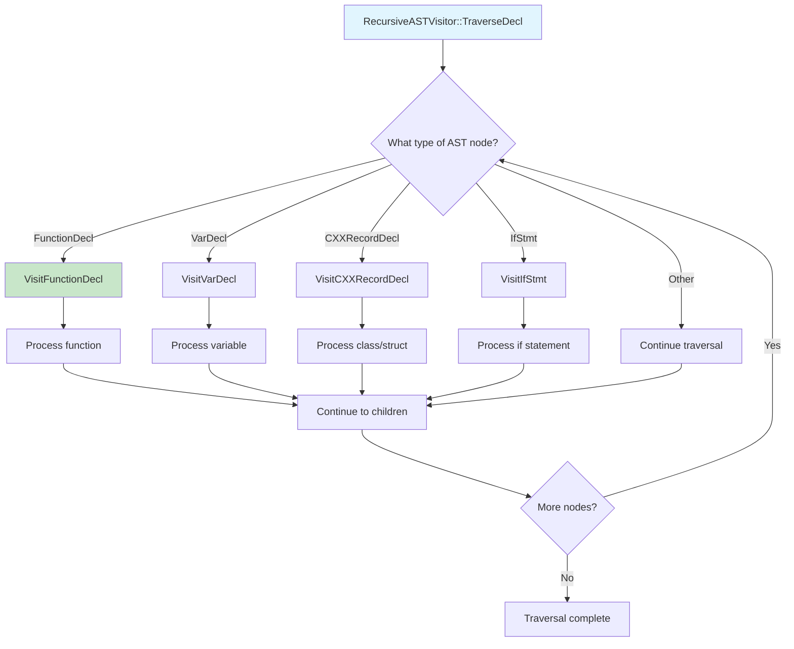
```mermaid
flowchart TD
    A[RecursiveASTVisitor::TraverseDecl] --> B{What type of AST node?}
    
    B -->|FunctionDecl| C[VisitFunctionDecl]
    B -->|VarDecl| D[VisitVarDecl] 
    B -->|CXXRecordDecl| E[VisitCXXRecordDecl]
    B -->|IfStmt| F[VisitIfStmt]
    B -->|Other| G[Continue traversal]
    
    C --> H[Process function]
    D --> I[Process variable]
    E --> J[Process class/struct]
    F --> K[Process if statement]
    
    H --> L[Continue to children]
    I --> L
    J --> L
    K --> L
    G --> L
    
    L --> M{More nodes?}
    M -->|Yes| B
    M -->|No| N[Traversal complete]
    
    style A fill:#e1f5fe
    style C fill:#c8e6c9
```

**xTrace's Custom Visitor Implementation:**

```cpp
class MethodVisitor : public clang::RecursiveASTVisitor<MethodVisitor> {
public:
    // Called automatically for every FunctionDecl in the AST
    bool VisitFunctionDecl(clang::FunctionDecl *func_decl) {
        // Our custom logic here
        // Return true to continue traversal, false to stop
        return processFunction(func_decl);
    }
    
    // We could override other Visit methods if needed:
    // bool VisitVarDecl(clang::VarDecl *var_decl) { ... }
    // bool VisitCallExpr(clang::CallExpr *call) { ... }
};
```

#### 3.4 Clang Rewriter - Source Code Modification

The `Rewriter` class provides precise text insertion and replacement based on AST source locations:

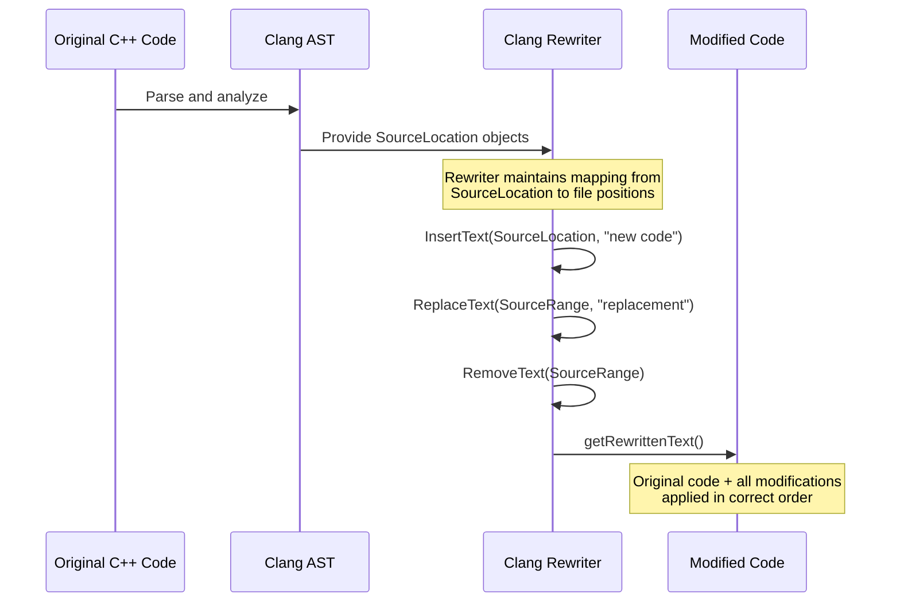
```mermaid
sequenceDiagram
    participant Code as Original C++ Code
    participant AST as Clang AST
    participant Rewriter as Clang Rewriter
    participant Output as Modified Code
    
    Code->>AST: Parse and analyze
    AST->>Rewriter: Provide SourceLocation objects
    
    Note over Rewriter: Rewriter maintains mapping from<br/>SourceLocation to file positions
    
    Rewriter->>Rewriter: InsertText(SourceLocation, "new code")
    Rewriter->>Rewriter: ReplaceText(SourceRange, "replacement")
    Rewriter->>Rewriter: RemoveText(SourceRange)
    
    Rewriter->>Output: getRewrittenText()
    
    Note over Output: Original code + all modifications<br/>applied in correct order
```

**How xTrace Uses Rewriter:**

```cpp
bool CodeRewriter::injectMethodEntryCode(const MethodInfo& method_info) {
    // 1. Get the function body AST node
    clang::Stmt* body = method_info.function_decl->hasBody();
    
    // 2. Find insertion point (after opening brace)
    clang::SourceLocation insertion_loc = body->getBeginLoc();
    
    // 3. Navigate to next line using SourceManager
    clang::SourceManager &source_mgr = rewriter_.getSourceMgr();
    insertion_loc = findNextLineStart(insertion_loc);
    
    // 4. Generate instrumentation code
    std::string method_entry_code = generateMethodEntryCode(method_info);
    
    // 5. Insert using Clang Rewriter
    return rewriter_.InsertText(insertion_loc, method_entry_code);
}
```

### 4. Detailed AST Processing Workflow

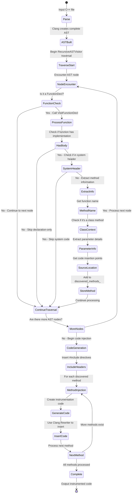
```mermaid
stateDiagram-v2
    [*] --> Parse: Input C++ file
    Parse --> ASTBuilt: Clang creates complete AST
    
    ASTBuilt --> TraverseStart: Begin RecursiveASTVisitor traversal
    TraverseStart --> NodeEncounter: Encounter AST node
    
    NodeEncounter --> FunctionCheck: Is it a FunctionDecl?
    FunctionCheck --> ProcessFunction: Yes - Call VisitFunctionDecl
    FunctionCheck --> ContinueTraversal: No - Continue to next node
    
    ProcessFunction --> HasBody: Check if function has implementation
    HasBody --> SystemHeader: Yes - Check if in system header
    HasBody --> ContinueTraversal: No - Skip declaration-only
    
    SystemHeader --> ExtractInfo: No - Extract method information
    SystemHeader --> ContinueTraversal: Yes - Skip system code
    
    ExtractInfo --> MethodName: Get function name
    MethodName --> ClassContext: Check if it's a class method
    ClassContext --> ParameterInfo: Extract parameter details
    ParameterInfo --> SourceLocation: Get code insertion points
    SourceLocation --> StoreMethod: Add to discovered_methods_
    
    StoreMethod --> ContinueTraversal: Continue processing
    ContinueTraversal --> MoreNodes: Are there more AST nodes?
    MoreNodes --> NodeEncounter: Yes - Process next node
    MoreNodes --> CodeGeneration: No - Begin code injection
    
    CodeGeneration --> IncludeHeaders: Insert #include directives
    IncludeHeaders --> MethodInjection: For each discovered method
    MethodInjection --> GenerateCode: Create instrumentation code
    GenerateCode --> InsertCode: Use Clang Rewriter to insert
    InsertCode --> NextMethod: Process next method
    NextMethod --> MethodInjection: More methods exist
    NextMethod --> Complete: All methods processed
    Complete --> [*]: Output instrumented code
```

### 5. AST Node Type Detection and Casting

Clang AST uses a hierarchy where specific node types inherit from base classes. xTrace uses dynamic casting to identify and work with specific node types:

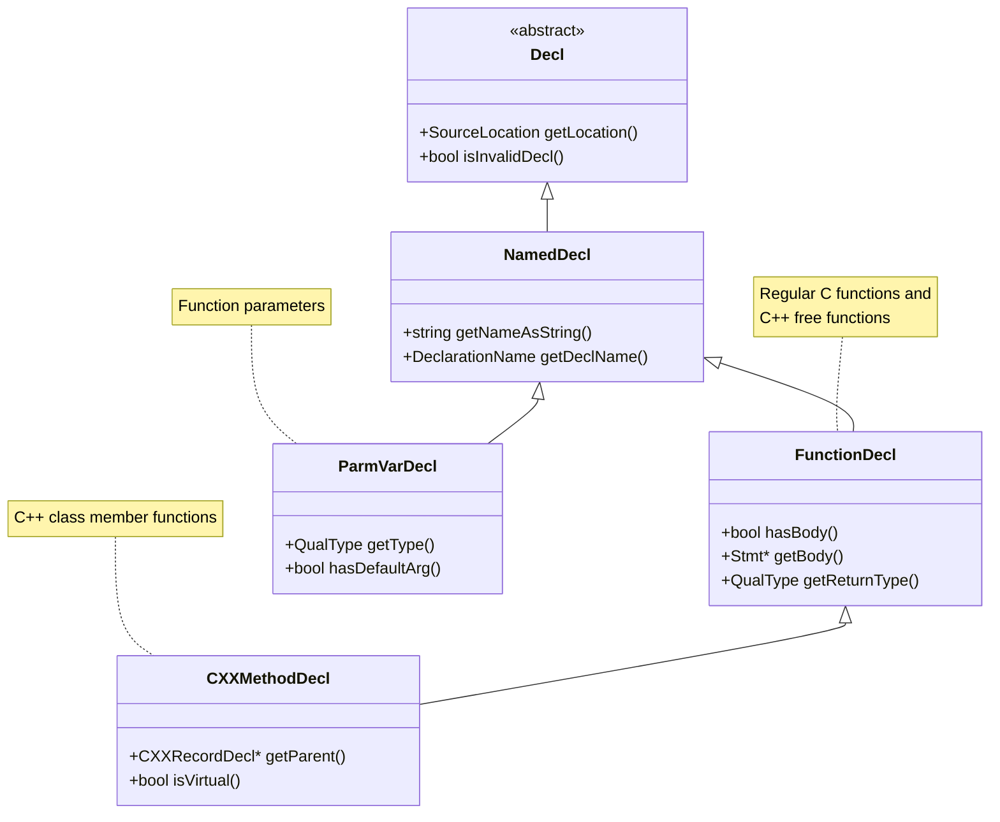
```mermaid
classDiagram
    class Decl {
        <<abstract>>
        +SourceLocation getLocation()
        +bool isInvalidDecl()
    }
    
    class NamedDecl {
        +string getNameAsString()
        +DeclarationName getDeclName()
    }
    
    class FunctionDecl {
        +bool hasBody()
        +Stmt* getBody()
        +QualType getReturnType()
    }
    
    class CXXMethodDecl {
        +CXXRecordDecl* getParent()
        +bool isVirtual()
    }
    
    class ParmVarDecl {
        +QualType getType()
        +bool hasDefaultArg()
    }
    
    Decl <|-- NamedDecl
    NamedDecl <|-- FunctionDecl
    FunctionDecl <|-- CXXMethodDecl
    NamedDecl <|-- ParmVarDecl
    
    note for FunctionDecl "Regular C functions and<br/>C++ free functions"
    note for CXXMethodDecl "C++ class member functions"
    note for ParmVarDecl "Function parameters"
```

**Dynamic Casting in xTrace:**

```cpp
std::string MethodVisitor::extractMethodName(clang::FunctionDecl* func_decl) {
    std::string name = func_decl->getNameAsString();
    
    // Try to cast to a more specific type
    if (clang::CXXMethodDecl* method_decl = clang::dyn_cast<clang::CXXMethodDecl>(func_decl)) {
        // This is a C++ class method, get the class name
        if (clang::CXXRecordDecl* record_decl = method_decl->getParent()) {
            std::string class_name = record_decl->getNameAsString();
            name = class_name + "::" + name;
        }
    }
    // Otherwise it's a regular C function or C++ free function
    
    return name;
}
```

### 6. Source Location Management

Understanding Clang's source location system is crucial for precise code injection:

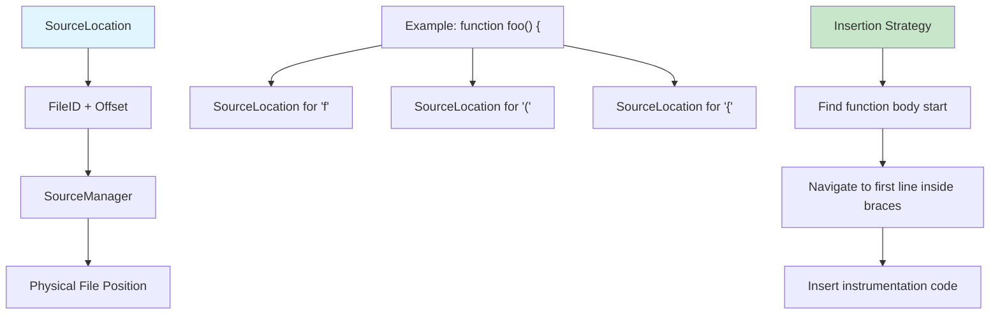
```mermaid
graph TB
    A[SourceLocation] --> B[FileID + Offset]
    B --> C[SourceManager]
    C --> D[Physical File Position]
    
    E["Example: function foo() {"] --> F["SourceLocation for 'f'"]
    E --> G["SourceLocation for '('"]  
    E --> H["SourceLocation for '{'"]
    
    I[Insertion Strategy] --> J[Find function body start]
    J --> K[Navigate to first line inside braces]
    K --> L[Insert instrumentation code]
    
    style A fill:#e1f5fe
    style I fill:#c8e6c9
```

**xTrace's Source Location Navigation:**

```cpp
bool CodeRewriter::injectMethodEntryCode(const MethodInfo& method_info) {
    // Get the opening brace location
    clang::SourceLocation insertion_loc = method_info.function_decl->getBody()->getBeginLoc();
    
    // Navigate past the opening brace to find insertion point
    clang::SourceManager &source_mgr = rewriter_.getSourceMgr();
    insertion_loc = insertion_loc.getLocWithOffset(1); // Move past '{'
    
    // Find the end of current line and move to next line
    const char* buffer_ptr = source_mgr.getCharacterData(insertion_loc);
    while (*buffer_ptr != '\n' && *buffer_ptr != '\0') {
        insertion_loc = insertion_loc.getLocWithOffset(1);
        buffer_ptr = source_mgr.getCharacterData(insertion_loc);
    }
    if (*buffer_ptr == '\n') {
        insertion_loc = insertion_loc.getLocWithOffset(1); // Move to start of next line
    }
    
    // Now insertion_loc points to the perfect spot for our code
    std::string code = generateMethodEntryCode(method_info);
    return rewriter_.InsertText(insertion_loc, code);
}
```

### 7. Type System Integration

Clang's type system provides rich information about C++ types, which xTrace uses for smart parameter logging:

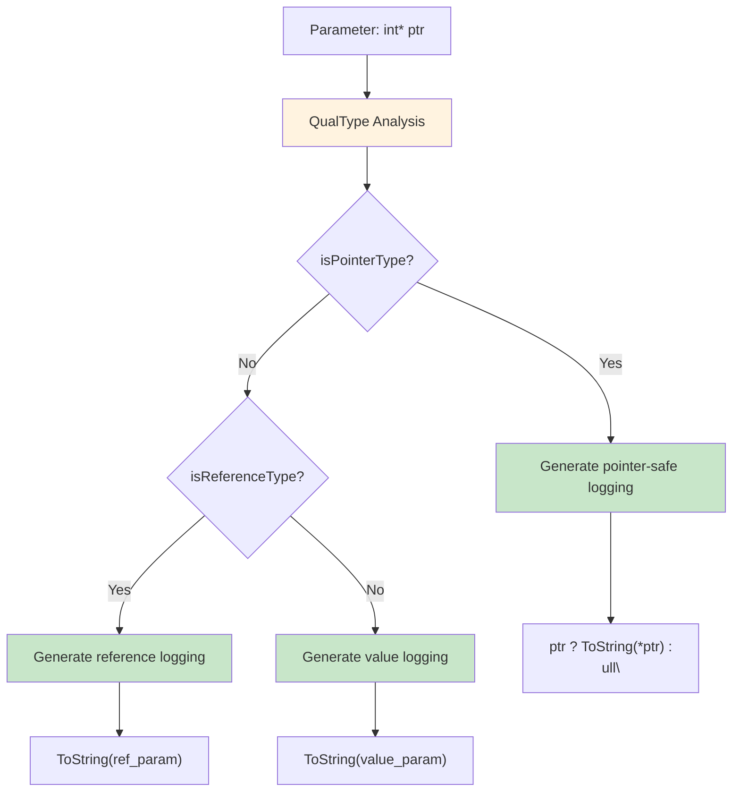
```mermaid
flowchart TD
    A[Parameter: int* ptr] --> B[QualType Analysis]
    B --> C{isPointerType?}
    C -->|Yes| D[Generate pointer-safe logging]
    C -->|No| E{isReferenceType?}
    E -->|Yes| F[Generate reference logging]
    E -->|No| G[Generate value logging]
    
    D --> H["ptr ? ToString(*ptr) : \"null\""]
    F --> I["ToString(ref_param)"]
    G --> J["ToString(value_param)"]
    
    style B fill:#fff3e0
    style D fill:#c8e6c9
    style F fill:#c8e6c9
    style G fill:#c8e6c9
```

**Type-Aware Code Generation:**

```cpp
std::string CodeRewriter::generateParameterLoggingCode(const MethodInfo& method_info) {
    std::ostringstream code;
    
    for (const auto* param : method_info.parameters) {
        std::string param_name = param->getNameAsString();
        clang::QualType param_type = param->getType();
        
        // Use Clang's type system to generate appropriate logging
        if (param_type->isPointerType()) {
            // Safe pointer logging with null check
            code << "  xtrace->LocalVarUpdate(xtrace_mrid, \"" << param_name 
                 << "\", " << param_name << " ? base::ToString(*" << param_name 
                 << ") : \"\");\n";
        } else if (param_type->isReferenceType()) {
            // Reference logging (no null check needed)
            code << "  xtrace->LocalVarUpdate(xtrace_mrid, \"" << param_name 
                 << "\", base::ToString(" << param_name << "));\n";
        } else {
            // Value type logging
            code << "  xtrace->LocalVarUpdate(xtrace_mrid, \"" << param_name 
                 << "\", base::ToString(" << param_name << "));\n";
        }
    }
    
    return code.str();
}
```

This detailed explanation should help new developers understand exactly how the Clang AST library integrates with the xTrace injector and how to extend or modify the system.
